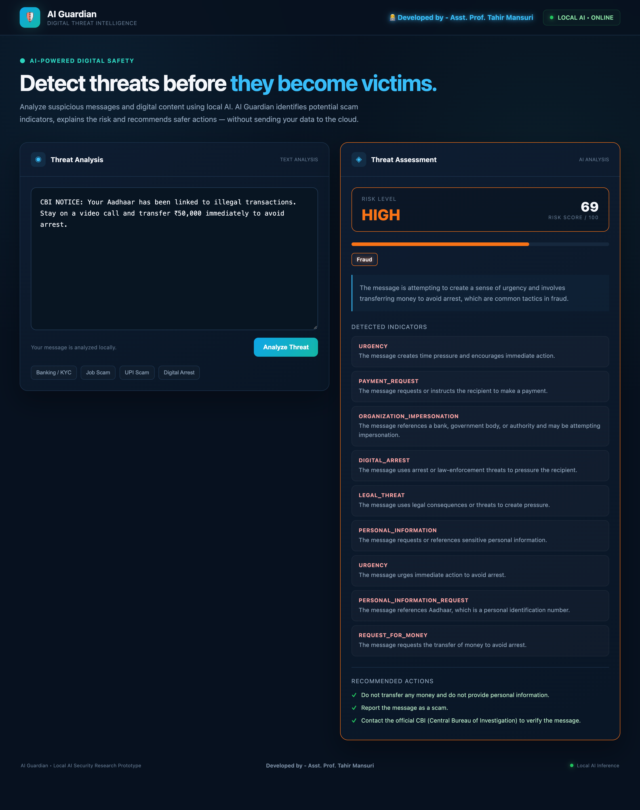

# AI Guardian

**AI Guardian: An Explainable Multimodal AI System for Detecting Digital Scams, Fraud and AI-Generated Deception**

A practical, research-oriented prototype for detecting digital scams, phishing, fraud, impersonation, social engineering, and other digital deception. Designed as a hybrid security system, AI Guardian leverages both deterministic security rules and large language models (LLMs) to provide an explainable threat assessment.

<br>

<div align="center">
  
</div>

---

<div align="center">
  <h2>👨‍💻 Developed By</h2>
  <h3><strong>Tahir Husen Najir Mansuri</strong></h3>
  <p><i>Lead System Engineer, Optimas AI</i><br>
  <i>HOD, Asst. Prof. at STES & Co Op Edu Society's IMRD, Shahada</i></p>
  <a href="https://github.com/TahirMansuri"></a>
</div>

---

## 🎯 Core Features

- **Multi-Provider AI Analysis:** Supports local LLMs (via `llama.cpp` for Qwen) and cloud APIs (OpenAI GPT-4o-mini, Google Gemini) to semantically understand messages and screenshots. Includes **Graceful Fallback**—if a cloud provider fails (e.g., no credits or network error), the system automatically defaults to the local offline model to prevent downtime.
- **Deterministic Scam Rules:** Evaluates text against 20+ rule-based triggers (urgency, OTP requests, digital arrest, KYC fraud, etc.) and assigns weighted severity scores.
- **URL Intelligence:** Analyzes suspicious URLs for missing HTTPS, IP-based hosts, URL shorteners, excessive subdomains, punycode, `@`-symbol tricks, suspicious keywords, and **WHOIS-based domain age**.
- **Screenshot / Image Analysis (Multimodal):** Extracts text from uploaded screenshots via **OCR (Tesseract)** and decodes **QR codes (pyzbar)** — then routes the extracted content through the same security engine.
- **Explainable Risk Aggregation:** Calculates a final risk score (0–100) and risk level (LOW, MEDIUM, HIGH, CRITICAL) by combining evidence from AI, URL analysis, and deterministic rules. Every indicator is tagged with its source (`Rule Engine`, `URL Analyzer`, `AI Model`).
- **100% Privacy Focused:** Everything runs locally without relying on external cloud LLM APIs.

---

## 🏗️ Architecture

```text
        Text Input              Screenshot Input
             |                        |
             |                        v
             |               OCR (Tesseract) + QR Decoder (pyzbar)
             |                        |
             +------------+-----------+
                          |
                          v
                    AI Guardian Engine
                          |
        +-----------------+-----------------+
        |                 |                 |
        v                 v                 v
  Semantic AI      Deterministic       URL Intelligence
(Multi-Provider)   Scam Rules        (WHOIS, Format,
 Local or Cloud     (Regex)            HTTPS, Punycode)
        |                 |                 |
        +-----------------+-----------------+
                          |
                          v
                  Risk Aggregation Layer
                          |
                          v
              Explainable Threat Assessment
                          |
        +-----------------+-----------------+
        |                 |                 |
        v                 v                 v
  Risk Level        Detected            Recommended
  & Score           Indicators          Actions
```

---

## 🚀 Setup & Running Instructions

To run AI Guardian locally, you need to start two independent components: the LLM engine and the unified backend/frontend server.

### 1. Prerequisites (For Screenshot Analysis)
You need system-level libraries for OCR and QR decoding:
- **macOS:** `brew install tesseract zbar`
- **Ubuntu/Debian:** `sudo apt install tesseract-ocr libzbar0`

### 2. Start the LLM Runtime (llama.cpp)
We use `llama.cpp` to run the semantic AI locally. Open your terminal and run:

```bash
cd /Users/tahirmansuri/AI-LAB/llama-Data/engine/llama.cpp
./build/bin/llama-server -m /Users/tahirmansuri/AI-LAB/llama-Data/models/Qwen2.5-7B-Instruct-Q4_K_M.gguf -ngl 22 --ctx-size 2048 --port 11434
```
*(Ensure the server is running on `http://127.0.0.1:11434`)*

### 3. Configure API Keys (Optional Cloud AI)
If you wish to use OpenAI or Gemini in the UI, copy the environment template:
```bash
cp backend/.env.example backend/.env
```
Add your API keys to `backend/.env`. If the cloud provider fails, the system gracefully falls back to your local model.

### 4. Start the AI Guardian Server
Open a **new terminal tab/window**, navigate to the project directory, and start the unified backend (which also serves the frontend):

```bash
cd backend
python3 -m venv .venv
source .venv/bin/activate
pip install -r requirements.txt
uvicorn main:app --reload --host 127.0.0.1 --port 8000
```
*(The UI will now be available at `http://127.0.0.1:8000`)*

---

## 📂 Project Structure

```text
AI-Guardian/
├── backend/
│   ├── main.py              # FastAPI Application (Serves API & Frontend)
│   ├── ollama_client.py     # HTTP Client communicating with llama.cpp
│   ├── risk_engine.py       # Core risk aggregation logic
│   ├── schemas.py           # Pydantic schemas for request/response validation
│   ├── .env                 # API Keys for Cloud Providers
│   ├── requirements.txt     # Python dependencies for the backend
│   ├── llm_providers/       # Abstracted multi-provider routing & graceful fallback
│   └── security/            # Security Intelligence Layer
│       ├── __init__.py
│       ├── scam_rules.py    # Deterministic Scam Rule Engine
│       ├── url_analyzer.py  # URL Intelligence
│       └── screenshot_analyzer.py # OCR and QR Extraction
├── frontend/
│   └── index.html           # Unified UI for text and screenshot testing
└── README.md                # Project documentation
```

---

## 🧪 Testing

Open the GUI at `http://127.0.0.1:8000` and try these scenarios:

### Text Analysis Tab
- **Phishing:** *Your SBI account will be blocked today. Complete KYC immediately at http://sbi-kyc-verify.com*
- **Job Scam:** *Congratulations! You have been selected for a work from home job. Pay ₹2,999 registration fee to activate your employment immediately.*
- **UPI Scam:** *Your UPI refund is pending. Scan this QR code and enter your UPI PIN to receive your refund immediately.*
- **Digital Arrest:** *CBI NOTICE: Your Aadhaar has been linked to illegal transactions. Stay on a video call and transfer ₹50,000 immediately to avoid arrest.*
- **Benign:** *Your college has scheduled the internal examination for Monday at 10 AM. Please bring your identity card.*

### Screenshot Analysis Tab
Upload any of these and confirm the extracted OCR text + QR codes appear alongside the risk assessment:
- Screenshot of a fake banking login page (e.g., a phishing SBI page) → **CRITICAL**
- Screenshot of a WhatsApp message containing `photo.jpg.apk` → **HIGH/CRITICAL**
- Screenshot containing a QR code (UPI payment request) → decoded QR runs through URL analyzer
- Screenshot of a legitimate bank SMS → **LOW/MEDIUM**
- Blank or unreadable image → **LOW**, "No content detected"

---

## 🌍 Hosting Online (Cloudflare Tunnel)

The unified architecture means one tunnel exposes the whole app (API + UI).

```bash
cloudflared tunnel --url http://127.0.0.1:8000
```
Share the generated URL (e.g., `https://random-words.trycloudflare.com`). Anyone opening it gets the full AI Guardian experience, while all inference continues to run locally and privately on your Mac.

---

## 🔬 Technical Highlights

- **Hybrid detection philosophy:** The LLM is not the sole authority. It contributes semantic evidence (capped at 15%), while deterministic rules (60%) and URL intelligence (25%) provide auditable, reproducible evidence.
- **Explainability by design:** Every indicator carries a source field (`Rule Engine`, `URL Analyzer`, `AI Model`) so the final verdict can be traced back to specific evidence.
- **Privacy-first Architecture:** Defaults to local-only inference (`Qwen2.5-7B` via `llama.cpp` with Vulkan/MoltenVK) while offering opt-in cloud AI features (OpenAI/Gemini).
- **Graceful Fallback Resilience:** If an active cloud AI provider fails (e.g., expired API key, network issue), the backend intercepts the error and seamlessly falls back to the local model, guaranteeing zero downtime.
- **Multimodal input:** Text and screenshots both flow into the same engine via input adapters (OCR + QR extraction), rather than two separate systems.
- **Rule overlap is intentional:** Some categories may co-fire (e.g., UPI PIN → CREDENTIAL_REQUEST + UPI_PAYMENT). The cap system prevents runaway scores. Future calibration may add mutually exclusive rules and severity normalization.

---

## ⚠️ Known Limitations

- **Static analysis only:** URL checks examine the string, not the live page. Cloaked phishing (harmless page for scanners, malicious page for real users) and drive-by downloads require dynamic analysis / sandboxing — planned as a future stage.
- **WHOIS reliability:** Some TLDs (particularly `.in`) return inconsistent WHOIS data. The analyzer fails silently when WHOIS is unavailable.
- **OCR noise:** Low-quality screenshots may produce artifacts that trigger rules. The AI layer partially compensates by attributing semantics correctly.
- **Audio/video deepfake detection:** Not implemented. Only text and image inputs are supported.

---

*(Developed for Aavishkar 2026 Student Competition)*
